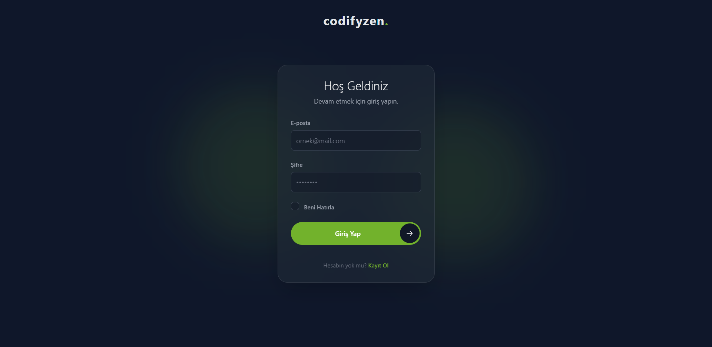
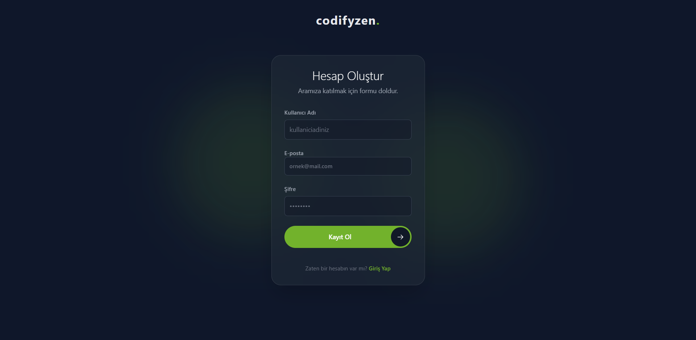
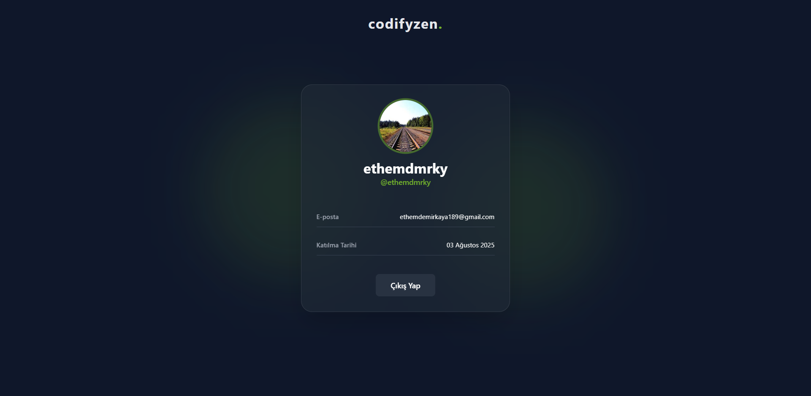

# Modern PHP Login & Register Sistemi

Bu proje, modern PHP standartları ve güvenlik önlemleri kullanılarak oluşturulmuş, şık ve duyarlı bir tasarıma sahip tam özellikli bir kullanıcı giriş, kayıt ve profil yönetimi sistemidir. Proje, Tailwind CSS'in CDN versiyonu kullanılarak tasarlanmış olup, kurulum gerektirmeyen bir ön yüz yapısına sahiptir.



---

## ✨ Özellikler

- **Modern ve Duyarlı Tasarım:** Tailwind CSS ile oluşturulmuş, Glassmorphism ve soft UI elementleri içeren, tüm cihazlarda harika görünen arayüzler.
- **Güvenli Kimlik Doğrulama:**
  - **Parola Hashing:** `PASSWORD_ARGON2ID` ile güçlü parola şifreleme.
  - **SQL Injection Koruması:** PDO ve parametreli sorgular (prepared statements) ile tam koruma.
  - **CSRF Koruması:** Formların güvenliğini sağlamak için her session'a özel token'lar.
  - **Kaba Kuvvet (Brute-Force) Saldırı Önlemi:** Belirli sayıda başarısız giriş denemesinden sonra geçici hesap kilitleme.
  - **Zamanlama Saldırısı Önlemi:** Giriş formunda kullanıcı adı varlığı hakkında bilgi sızdırılmasını engeller.
- **"Beni Hatırla" Özelliği:** Güvenli, veritabanı tabanlı kalıcı oturum token'ları ile kullanıcı dostu deneyim.
- **Dinamik Profil Sayfası:** Kullanıcılar giriş yaptığında kendi bilgilerini (kullanıcı adı, e-posta, kayıt tarihi) görüntüler.
- **Fonksiyonel ve Modüler Kod:** `functions/Auth.php` içinde toplanmış, anlaşılır ve yeniden kullanılabilir fonksiyonlar.
- **Kolay Kurulum:** Sadece veritabanı bilgilerinizi girerek projeyi hızlıca çalıştırabilirsiniz.

---

## 🚀 Kurulum

Projeyi yerel makinenizde çalıştırmak için aşağıdaki adımları izleyin.

### Gereksinimler
- PHP 8.0 veya üstü
- MySQL veya MariaDB veritabanı
- Apache veya Nginx gibi bir web sunucusu (WAMP, MAMP, XAMPP gibi paketler işinizi görecektir)

### Adım 1: Projeyi Klonlayın
```bash
git clone https://github.com/ethemdemirkaya/PHP-Secure-Auth.git
cd PHP-Secure-Auth/
```

### Adım 2: Veritabanını Ayarlayın
1.  Veritabanı sunucunuzda (örn: phpMyAdmin) `login_system` adında yeni bir veritabanı oluşturun.
2.  Aşağıdaki SQL kodunu bu veritabanında çalıştırarak gerekli tabloları oluşturun:

```sql
-- users tablosu
CREATE TABLE `users` (
  `id` INT(11) NOT NULL AUTO_INCREMENT,
  `username` VARCHAR(50) NOT NULL,
  `email` VARCHAR(255) NOT NULL,
  `password_hash` VARCHAR(255) NOT NULL,
  `created_at` TIMESTAMP NOT NULL DEFAULT CURRENT_TIMESTAMP,
  PRIMARY KEY (`id`),
  UNIQUE KEY `email` (`email`),
  UNIQUE KEY `username` (`username`)
) ENGINE=InnoDB DEFAULT CHARSET=utf8mb4 COLLATE=utf8mb4_unicode_ci;

-- auth_tokens tablosu
CREATE TABLE `auth_tokens` (
  `id` INT(11) NOT NULL AUTO_INCREMENT,
  `user_id` INT(11) NOT NULL,
  `selector` VARCHAR(255) NOT NULL,
  `hashed_validator` VARCHAR(255) NOT NULL,
  `expires_at` DATETIME NOT NULL,
  PRIMARY KEY (`id`),
  UNIQUE KEY `selector` (`selector`),
  FOREIGN KEY (`user_id`) REFERENCES `users`(`id`) ON DELETE CASCADE
) ENGINE=InnoDB DEFAULT CHARSET=utf8mb4 COLLATE=utf8mb4_unicode_ci;
```

### Adım 3: Veritabanı Bağlantısını Yapılandırın
Proje içindeki `config/database.php` dosyasını açın ve kendi veritabanı bilgilerinizi girin:

```php
<?php
$host = 'localhost';
$dbname = 'login_system'; // Oluşturduğunuz veritabanı adı
$user = 'root';          // Veritabanı kullanıcı adınız
$pass = '';              // Veritabanı şifreniz

try {
    $pdo = new PDO("mysql:host=$host;dbname=$dbname;charset=utf8mb4", $user, $pass);
    $pdo->setAttribute(PDO::ATTR_ERRMODE, PDO::ERRMODE_EXCEPTION);
    $pdo->setAttribute(PDO::ATTR_DEFAULT_FETCH_MODE, PDO::FETCH_ASSOC);
} catch (PDOException $e) {
    // Gerçek bir projede bu hata detayları kullanıcıya gösterilmemelidir.
    die("Veritabanı bağlantısı kurulamadı: " . $e->getMessage());
}
?>
```

### Adım 4: Projeyi Çalıştırın
Web sunucunuzu başlatın ve tarayıcınızdan projenin bulunduğu adrese gidin (örn: `http://localhost/login-register/`). Artık kayıt olup giriş yapabilirsiniz!

---

## 📸 Ekran Görüntüleri

<!-- GÖRSEL EKLEME YERİ: Login, Register ve Profil sayfalarının ekran görüntülerini buraya ekleyebilirsiniz. -->

**Giriş Sayfası**


**Kayıt Sayfası**


**Profil Sayfası**


---

## 🛠️ Kullanılan Teknolojiler

- **Backend:** PHP
- **Veritabanı:** MySQL
- **Ön Yüz:** HTML, Tailwind CSS (CDN)
- **Güvenlik:** PDO, CSRF Token'ları, Argon2ID Hashing
